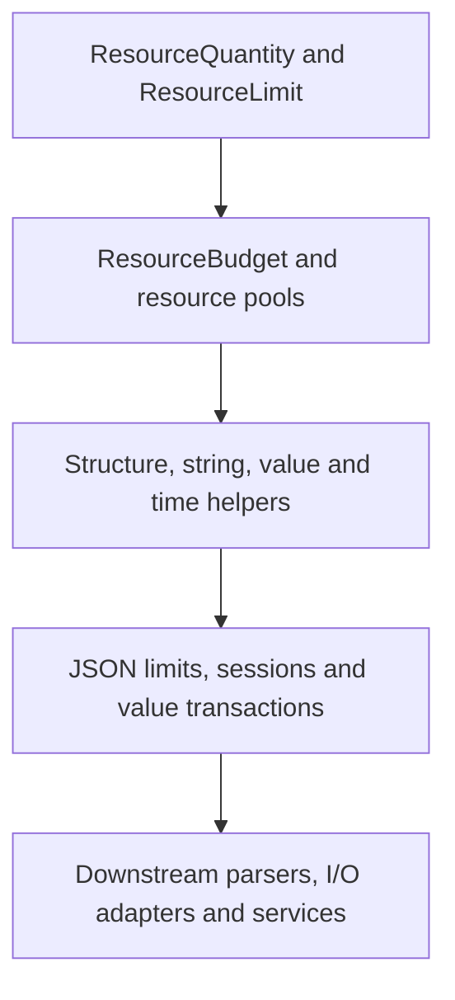

# qubit-budget design

[中文设计文档](design.zh_CN.md) · [User guide](user_guide.md) · [README](../README.md)

This document records the stable accounting semantics and maintenance decisions
behind `qubit-budget` 0.4.x. Public API details remain authoritative in the
[API documentation](https://docs.rs/qubit-budget).

## Goals and boundaries

The crate separates finite resource accounting from the work being measured.
It provides exact quantities, immutable limits, mutable budgets and reusable
pools, then composes them into structure, value, string, time and JSON helpers.
Callers still choose resource identities, numerical limits, parsing, I/O,
waiting and recovery policy.

The design does not provide hidden unlimited objects, asynchronous waiting,
fair scheduling, parsing or whole-operation rollback. An unconfigured
dimension is represented by `None`; a configured budget is always finite.

## Layered model and dependency direction

Dependencies point downward in the diagram. Core resource accounting does not
depend on JSON or downstream adapters. Optional integrations add only their
domain dependency:

| Layer | Main types | Stable responsibility |
| --- | --- | --- |
| Exact values and facts | `ResourceQuantity`, `QuantityMeasurement`, `ResourceLimit` | Preserve native measurements and check one observation without mutation. |
| Mutable finite state | `ResourceBudget`, `ResourcePool`, `ManagedResourcePool` | Spend or temporarily acquire capacity while keeping rejected operations atomic. |
| Domain composition | `StructureBudget`, `StringLimits`, `DurationBudget`, numeric limits | Reuse the primitive rules for one domain without adding parsing or I/O. |
| JSON accounting | decode/encode limits, sessions, attempts and `JsonValueTransaction` | Separate immediate I/O charges from staged accounting for one complete value. |
| Downstream adapters | `qubit-json`, `qubit-http`, `qubit-config` and other callers | Decide what work to measure and map typed failures into domain errors. |

`ResourceQuantity` is sealed to the unsigned integer types whose zero, one,
ordering and checked addition semantics are known. This keeps generic
accounting exact and prevents an implementation with surprising arithmetic
from violating budget invariants.

## Ownership and borrowing

`ResourceLimit` is immutable and may be copied or cloned when its fields allow
it. `ResourceBudget` is deliberately not `Clone`: cloning would duplicate a
finite allowance. `ResourcePool` has one explicit owner and checked
`try_acquire`/`release` pairing. `ManagedResourcePool` instead shares state
through `Arc` and transfers each acquired amount into a non-cloneable permit;
consuming `release` or `Drop` returns that amount once.

JSON sessions support two storage modes:

- `from_limits` creates a `'static` session that owns budgets derived from
  immutable limits.
- `borrowing_*` constructors hold exclusive references to caller-owned
  budgets, allowing several adapters to share an explicitly chosen accounting
  lifetime without copying capacity.

`begin_value` reborrows the session budgets for one attempt. Raw input,
normalized input and accepted output use the borrowed `ResourceBudget`
directly. The value side creates a `JsonValueTransaction` containing a
fixed-size working snapshot and an exclusive reference to its target
`JsonValueBudget`. Rust's borrow rules prevent another attempt from mutating
the same session state before the first attempt is committed or dropped.

## Atomicity and state transitions

The core rejected-charge rule is local: a failed single limit, budget or pool
operation does not mutate that object. `ResourceBudget::try_consume_group`
checks every member before charging any member.

JSON deliberately has two independent ledgers:

| Operation | Immediate state | Staged value state | On Drop or failed outer operation |
| --- | --- | --- | --- |
| Accepted raw/normalized input | retained | unchanged | retained |
| Accepted writer output prefix | retained | unchanged | retained |
| Accepted value measurement | unchanged | staged | discarded unless committed |
| Successful `commit` | unchanged | published | committed usage remains |
| Rejected value measurement | unchanged | poisoned | all staged usage discarded |

Dropping a transaction cannot undo a callback, object mutation, hasher update,
or an accepted output prefix. Adapters that require a wider business
transaction must provide that boundary themselves.

## Errors and deterministic priority

Errors preserve resource identity and exact measurements. Point checks use
`LimitExceededError`; cumulative capacity uses
`InsufficientBudgetError`; native conversion plus either category is wrapped
by `MeasuredBudgetError`. Pool release, grouped charges, string rendering and
clock deadlines retain their own structured context.

When several checks could fail, their order is part of the contract:

1. Convert only measurements required by configured dimensions.
2. For JSON values, check conversion, depth and variant-specific point limits.
3. Check cumulative node capacity before cumulative payload capacity.
4. Retain the first failed value admission and return it from every later
   admission and `commit`.
5. In string rendering, a captured writer failure takes priority over the
   renderer's wrapper error.

Downstream code should inspect typed accessors and variants rather than parse
`Display` text, whose wording is diagnostic rather than a wire format.

## Concurrency and pool recovery

`ManagedResourcePool` protects only the available quantity with a
`std::sync::Mutex`. Resource identity and total capacity are immutable and do
not require the lock. Acquisition holds the lock only while checking and
subtracting capacity; it releases the lock before cloning a resource for an
error. Permit Drop performs checked addition and never waits for capacity.

If the mutex is poisoned, the implementation recovers the guarded primitive
quantity. Critical sections contain only comparisons and unsigned arithmetic,
and permit Drop must not panic during unwinding. A defensive release caps
availability at total capacity if an internal invariant is violated. This
recovery is not a scheduling policy: the pool offers neither waiting,
cancellation nor fairness.

## Features and downstream boundary

The default feature set exposes the core accounting layers without optional
domain dependencies. `json`, `time`, `big-integer` and `big-decimal` are
opt-in; `big-decimal` also enables `big-integer`. Feature gates stay at the
narrowest public module or re-export, and docs.rs builds all features with
visible `doc(cfg)` annotations.

Current downstream use confirms the boundary: HTTP and configuration code
compose core budgets, local-files owns managed permits, retry combines count,
duration and deadline budgets, datatype enables numeric helpers, and JSON
adapters own parsing while borrowing or owning JSON accounting sessions.

## API evolution

The public contract includes resource identity, exact quantities, failure
atomicity, deterministic error priority and the immediate-versus-staged JSON
boundary. Changes to those semantics, public enum exhaustiveness, generic
defaults or feature relationships require a compatibility review.

New domain helpers should depend on core primitives instead of adding domain
logic to them. New inherent methods stay with their owning type; adapter-only
behavior belongs in the downstream crate or an explicit extension layer.
Adding a dependency to the default feature set requires evidence that the
capability is truly universal.

## Verification strategy

Verification mirrors the invariants rather than implementation line count:

- External tests exercise public success, error, boundary, ownership,
  transaction and deterministic-priority behavior.
- Property tests check conservation laws such as
  `used + remaining == limit` across operation sequences.
- Doctests and compiled bilingual-guide snippets keep examples aligned with the
  public API and declared features.
- Miri checks ownership, Drop and unsafe-code assumptions; the crate currently
  contains no project-owned unsafe code.
- Bounded fuzz targets exercise public budget, transactional JSON and
  budgeted-string APIs with allocation bounds and state invariants.
- CI checks default, all-feature and supported feature combinations, while
  coverage identifies unobserved error paths that need either a real regression
  or an explicit exemption.
