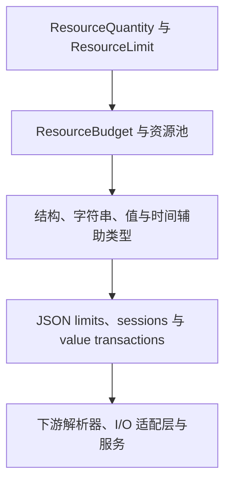

# qubit-budget 设计文档

[English design document](design.md) · [用户手册](user_guide.zh_CN.md) · [README](../README.zh_CN.md)

本文记录 `qubit-budget` 0.4.x 稳定的记账语义与维护决策。公共 API 的具体签名和用法以
[API 文档](https://docs.rs/qubit-budget)为准。

## 目标与边界

本 crate 将有限资源记账与被测量的业务工作分离。底层提供精确数量、不可变 limit、
可变 budget 和可复用 pool，再组合出结构、值、字符串、时间与 JSON 辅助类型。资源
标识、具体限额、解析、I/O、等待和恢复策略仍由调用方决定。

本设计不提供隐藏的无限对象、异步等待、公平调度、解析或整个操作的自动回滚。未配置
的维度用 `None` 表示；只要创建了 budget，它就一定有有限上限。

## 分层模型与依赖方向

依赖方向沿图从上到下。核心资源记账不依赖 JSON 或下游适配层；每个可选集成只引入
自身领域所需的依赖：

| 层次 | 主要类型 | 稳定职责 |
| --- | --- | --- |
| 精确值与事实 | `ResourceQuantity`、`QuantityMeasurement`、`ResourceLimit` | 保留原生测量值，并在不修改状态的情况下检查一次观测。 |
| 可变有限状态 | `ResourceBudget`、`ResourcePool`、`ManagedResourcePool` | 消耗或临时占用容量，同时保证被拒绝的操作具有原子性。 |
| 领域组合 | `StructureBudget`、`StringLimits`、`DurationBudget`、数值 limits | 在特定领域复用底层规则，不承担解析或 I/O。 |
| JSON 记账 | decode/encode limits、sessions、attempts 与 `JsonValueTransaction` | 区分立即生效的 I/O 计费和完整 value 的暂存计费。 |
| 下游适配 | `qubit-json`、`qubit-http`、`qubit-config` 等调用方 | 决定测量哪些工作，并把类型化错误映射成领域错误。 |

`ResourceQuantity` 是 sealed trait，只允许使用零、一、顺序关系和 checked addition
语义明确的无符号整数类型。这样可以保持泛型记账精确，避免异常算术实现破坏预算不变量。

## 所有权与借用

`ResourceLimit` 不可变；字段类型允许时，它可以复制或克隆。`ResourceBudget` 有意
不实现 `Clone`，否则一份有限额度会被复制成两份。`ResourcePool` 由单一所有者通过
`try_acquire`/`release` 显式配对；`ManagedResourcePool` 则通过 `Arc` 共享状态，
把每次取得的数量交给不可克隆的 permit，消费式 `release` 或 `Drop` 只归还一次。

JSON session 有两种存储模式：

- `from_limits` 根据不可变 limits 创建并持有 budget，得到 `'static` session；
- `borrowing_*` 构造函数独占借用调用方的 budget，使多个适配层可以在不复制容量的
  前提下显式选择共同的记账生命周期。

`begin_value` 会为一次 attempt 重新借用 session budget。raw input、normalized input
和 accepted output 直接使用借到的 `ResourceBudget`；value 侧创建
`JsonValueTransaction`，其中包含固定大小的工作快照和指向目标
`JsonValueBudget` 的独占引用。Rust 的借用规则会阻止同一 session 在当前 attempt
提交或丢弃前被另一个 attempt 修改。

## 原子性与状态迁移

底层的拒绝原子性是局部保证：一次 limit、budget 或 pool 操作失败时，不改变对应对象。
`ResourceBudget::try_consume_group` 会先检查全部成员，再统一扣减。

JSON 有意维护两套独立账本：

| 操作 | 立即账本 | 暂存 value 状态 | Drop 或外围操作失败后 |
| --- | --- | --- | --- |
| 接受 raw/normalized input | 保留 | 不变 | 保留 |
| 接受 writer output prefix | 保留 | 不变 | 保留 |
| 接受 value measurement | 不变 | 暂存 | 未提交时丢弃 |
| `commit` 成功 | 不变 | 发布 | 已提交用量保留 |
| value measurement 被拒绝 | 不变 | poisoned | 全部暂存用量丢弃 |

丢弃 transaction 不能撤销 callback、对象 mutation、Hasher 更新或底层 writer 已接受的
output prefix。需要更宽业务事务的适配层必须自行提供对应边界。

## 错误模型与确定性优先级

错误会保留资源标识和精确测量值。单点检查使用 `LimitExceededError`，累计容量使用
`InsufficientBudgetError`，原生数量转换以及上述两类错误统一由
`MeasuredBudgetError` 承载。资源池归还、预算组、字符串生成和时钟截止时间各自保留
对应的结构化上下文。

多个检查可能同时失败时，检查顺序属于稳定契约：

1. 只转换已配置维度真正需要的测量值。
2. JSON value 按数量转换、深度、variant 特定点限制的顺序检查。
3. 累计记账先检查 node 容量，再检查 payload 容量。
4. value admission 首次失败后保留该错误；之后的 admission 和 `commit` 都返回它。
5. 字符串生成已捕获 writer 失败时，该失败优先于 renderer 外层返回的错误。

下游应检查类型化 accessor 和错误 variant，不应解析 `Display` 文本；显示文本只用于
诊断，不是稳定的传输格式。

## 并发与资源池恢复

`ManagedResourcePool` 只用 `std::sync::Mutex` 保护 available quantity。资源标识和
总容量不可变，不需要加锁。获取容量时只在检查和扣减期间持锁；构造错误所需的资源克隆
发生在解锁之后。permit Drop 使用 checked addition 归还数量，也不会等待容量。

mutex poisoned 时，实现会恢复其中的原始数量。临界区只包含比较和无符号算术，同时
permit Drop 在 unwind 期间不得 panic。如果内部不变量意外失效，防御性 release 会把
available 限制在总容量以内。该恢复策略不等于调度策略：资源池不提供等待、取消或
公平性保证。

## Feature 与下游边界

默认 feature 只暴露核心记账层，不引入可选领域依赖。`json`、`time`、
`big-integer` 和 `big-decimal` 按需启用，其中 `big-decimal` 同时启用
`big-integer`。feature gate 位于最窄的公共模块或重导出位置；docs.rs 使用全部
feature，并通过 `doc(cfg)` 显示要求。

当前下游用法验证了这一边界：HTTP 和配置代码组合核心 budget；local-files 持有
managed permit；retry 组合次数、时长和截止时间预算；datatype 启用数值辅助类型；
JSON 适配层负责解析，并选择持有或借用 JSON accounting session。

## API 演进

公共契约包括资源标识、精确数量、失败原子性、确定性错误优先级，以及 JSON 中立即计费
与暂存计费的边界。修改这些语义、公共 enum 的穷尽性、泛型默认值或 feature 关系时，
必须进行兼容性审查。

新增领域辅助类型应依赖核心原语，不能把领域逻辑塞回底层类型。新增 inherent 方法应留
在其所属类型；仅适配层需要的行为应放在下游 crate 或显式 extension layer。只有证据
表明某项能力对所有使用者都普遍适用时，才能给默认 feature 增加依赖。

## 验证策略

验证围绕不变量组织，而不是追求实现行数：

- 外部测试通过公共 API 覆盖成功、错误、边界、所有权、事务和确定性优先级。
- 属性测试检查操作序列中的守恒关系，例如 `used + remaining == limit`。
- doctest 与可编译的双语用户指南片段保证示例持续匹配公共 API 和 feature。
- Miri 检查所有权、Drop 和 unsafe 假设；当前 crate 没有项目自有 unsafe 代码。
- 有界 fuzz target 通过公开的 budget、事务式 JSON 和预算字符串 API 检查状态不变量，
  并限制输入与分配规模。
- CI 检查默认、全部 feature 和支持的 feature 组合；覆盖率用于发现未观察的错误路径，
  这些路径必须补真实回归或记录明确豁免。
